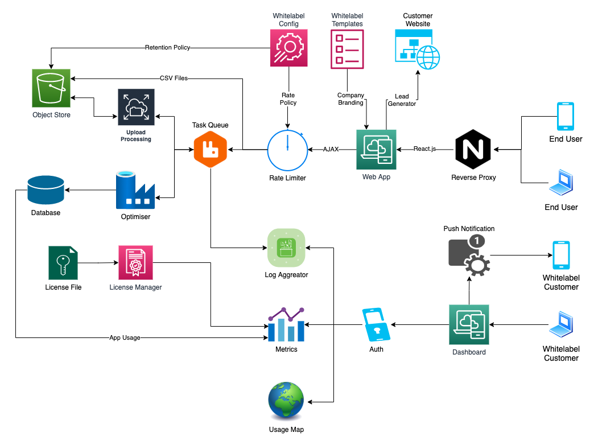

	docker run --rm -d -p 9000:9000 --name orxa_minio minio/minio server /data
	
	cd api
	python3 -m venv venv
	source venv/bin/activate
	pip install -r requirements.txt
	python3 application.py

	cd db
	docker run --rm -d --name orxa_postgres -p 5432:5432 -e POSTGRES_PASSWORD=password -v "$PWD/startup_scripts":/docker-entrypoint-initdb.d postgres

Point broswer at localhost:5000 for API documentation

# LC App Phase 2

This repo contains the API and billing services for LC App Phase 2, which optimally sizes solar PV and battery storage for a complex containing one or more buildings.

Instructions for testing and deploying these services are given in readme files at /api and /billing respectively.

## Dependencies

LC App Phase 2 consists of five services:

	- API service (Python3 Flask) - https://bitbucket.org/OrxaGridRepo/solarpv_battery/src/master/api/
    - Billing service (Python3 Docker) - https://bitbucket.org/OrxaGridRepo/solarpv_battery/src/master/billing/
    - Subscription service (C# dotnet) - https://bitbucket.org/OrxaGridRepo/contosoampbasic/src/dev/
    - Frontend (React.js) - https://bitbucket.org/OrxaGridRepo/solarpv-phase2/src/master/
    - Database (postgres Azure) - lcapppostgreserver.postgres.database.azure.com

	docker build -t rabwent11/lcapp2:api-v1 -f ./api/Dockerfile.prod ./api
	docker push rabwent11/lcapp2:api-v1
	
	docker build -t rabwent11/lcapp2:frontend-v1 -f ./frontend/Dockerfile.prod ./frontend
	docker push rabwent11/lcapp2:frontend-v1
