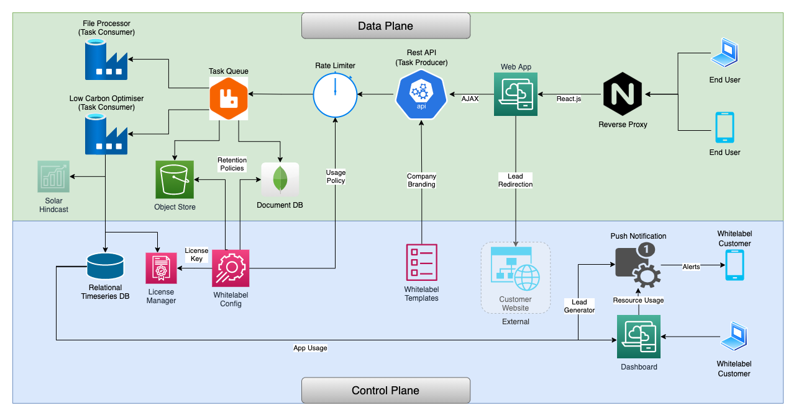
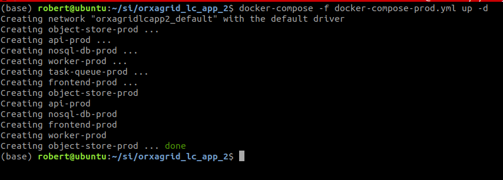
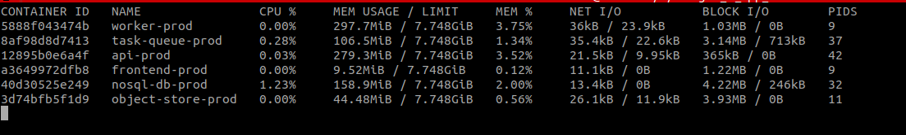
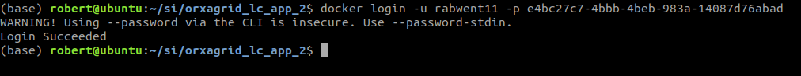
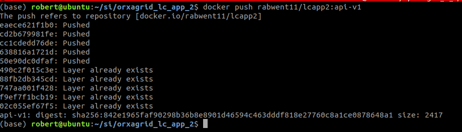
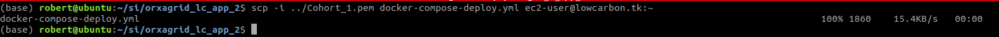
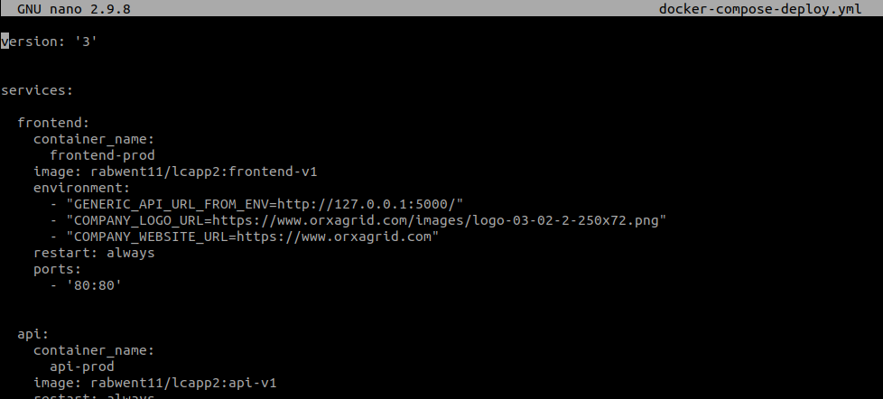

# OrxaGrid B2B2C Low Carbon App 2

## Description

This application is a solar PV and battery system optimiser designed to be
deployed by system installers for integration with their company website.

## Architecture

 - Reverse Proxy routes requests to the relevent service (todo)
 - Web App serves HTML/CSS/JS content
 - REST API interchanges data between the Web App and all other backend services
 - Rate limiter prevents a single user over using the api (todo)
 - Task queue routes work between API and data factories
 - File processor is a data factory for cleaning uploaded files
 - Low Carbon Optimiser is a data factory for sizing battery and solar PV systems
 - Solar Hindcast provides solar generation data for a given location (todo)
 - Object Store persists uploaded and cleaned files
 - Document DB persists optimisation results
 - Relational DB stores app usage statistics
 - License Manager restricts operation of the optimiser to licensed installations (todo)
 - Whitelabel Config enables custom branding of the Web App
 - Whitelabel Templates enables custom branding of the optimisation reports (todo)
 - Push Notifications generates sales leads and sends to system installers (todo)
 - Dashboard displays business intelligence about how the app is being used (todo)

## Build Environment
This application should be built using Linux Docker on a Mac, Linux or Windows
host with x64 architecture.

## Deploy Environment
This application has been tested on a Linux Ubuntu host with x64 architecture,
but should be deployable on any modern linux host with Docker installed.

## Development
- Install Docker (https://docs.docker.com/get-docker/)
- Insall Docker Compose (https://docs.docker.com/compose/install/)  

### Run the following commands to start the app in dev mode  
*Frontend and API services will hot-reload*  

	docker-compose pull
	docker-compose build .
	docker-compose up -d

### Check the services which came up
 	docker stats

### Check the logs
	docker-compose logs -f

### Open app in browser
	http://localhost

## Testing
- Install Postman (https://www.postman.com/downloads/)
- Import API endpoint tests into Postman (orxagrid_si.postman_collection.json) (included in root of this repo)
- Run the following endpoints

### File upload
*Choose 'sample_load.csv' as 'file' (included in root of this repo)*

Send the request, and note the returned file handles

### File Download
*Replace the file handle with that noted in previous step*

### Optimise

### Follow the link given by Location in response header, using GET request

*Response status code should be 202 until the results are ready*

Keep calling the endpoint  
*Response status code should be 200 when results are ready*

## Local Deployment
*Locally built images, with production web servers, no hot-reloading of code*

	docker-compose -f docker-compose-prod.yml build
	docker-compose -f docker-compose-prod.yml up -d

	docker stats

*Open app in browser*

	http://localhost

## Production Deployment (manual)

### Build the API / Worker and Frontend images locally for remote deployment

	docker build -t rabwent11/lcapp2:api-v1 -f ./api/Dockerfile.prod ./api
	docker build -t rabwent11/lcapp2:frontend-v1 -f ./frontend/Dockerfile.prod ./frontend

### Login to Dockerhub

	docker login -u rabwent11 -p <password_or_token>

### Push the images to Dockerhub

	docker push rabwent11/lcapp2:api-v1
	docker push rabwent11/lcapp2:frontend-v1

### Copy docker-compose-deploy.yml to remote server

- e.g. using scp

### Open an ssh sesion to remote server

- see (https://www.ssh.com/academy/ssh/command) for instructions
- following steps are carried out on remote server over ssh

### Edit the whitelabel configuration variables in docker-compose-deploy.yml

	nano docker-compose-deploy.ym

- GENERIC_API_URL_FROM_ENV - this should be the URL or IP of remote server, port 5000
- COMPANY_LOGO_URL - url for the logo of the company purchasing / hosting the app
- COMPANY_WEBSITE_URL - url for the website of the company purchasing / hosting the app

### Save the file and close

	<CTRL-O>
	<CTRL-X>

### Set up Docker
- Install Docker (https://docs.docker.com/get-docker/)
- Insall Docker Compose (https://docs.docker.com/compose/install/)  
- Login to Dockerhub

	docker login -u rabwent11 -p <password_or_token>

### Pull required images

	docker-compose -f docker-compose-deploy.yml pull

### Start app

	docker-compose -f docker-compose-deploy.yml up -d

### Configure firewall
- Ensure ports 80 and 5000 are open

### Test app
- Open remote server url in a browser on local machine

## Production Deployment (automatic)

### AWS Console
- Sign up / sign in to (http://console.aws.amazon.com)
- Select All Services >> Lighsail
- 
